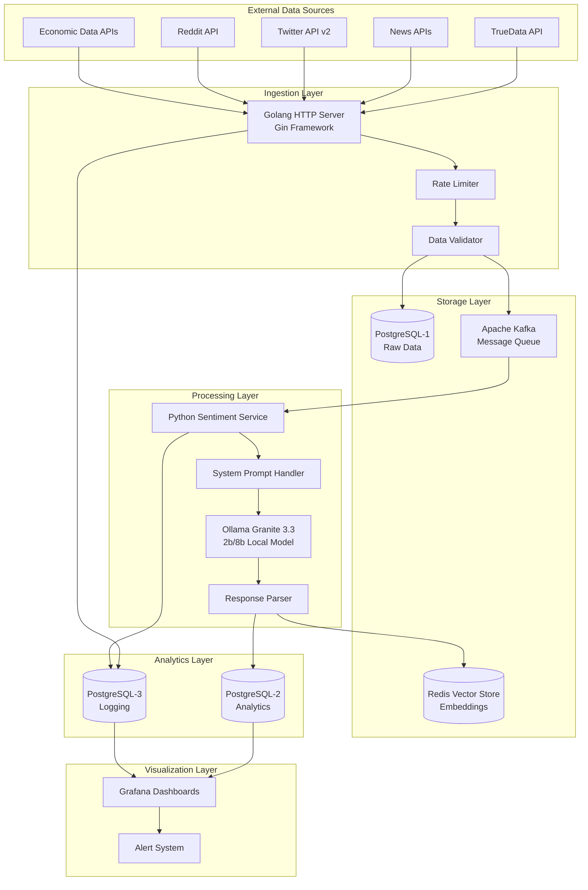

# Design Document

## Overview

The Real-time Sentiment Analysis (RTSA) system is designed as a microservices architecture that processes financial data streams through a multi-stage pipeline. The system emphasizes performance, scalability, and real-time processing while maintaining data integrity and providing comprehensive monitoring capabilities.

The architecture follows an event-driven pattern where data flows through distinct processing stages, each optimized for specific tasks. This design enables horizontal scaling, fault tolerance, and efficient resource utilization.

## Architecture

### High-Level Architecture Diagram



### Service Communication Pattern

The system uses asynchronous communication through Kafka topics to decouple services and enable independent scaling:

1. **Ingestion → Processing**: `sentiment_analysis_topic`
2. **Processing → Aggregation**: `aggregation_topic`  
3. **Alerts**: `alert_topic`

## Components and Interfaces

### 1. Data Ingestion Service (Golang)

**Purpose**: High-performance HTTP server for receiving and validating external data

**Key Components**:
- **HTTP Router**: Gin framework with middleware for CORS, rate limiting, and logging
- **Webhook Handlers**: Specialized handlers for each data source type
- **Data Validator**: Schema validation and sanitization
- **Database Client**: PostgreSQL connection with connection pooling
- **Kafka Producer**: Message publishing with retry logic

**API Endpoints**:
```go
// Webhook endpoints
POST /webhook/truedata
POST /webhook/news
POST /webhook/twitter
POST /webhook/reddit
POST /webhook/economic

// Health and monitoring
GET /health
GET /metrics
```

**Configuration Structure**:
```go
type Config struct {
    Server struct {
        Port         int    `yaml:"port"`
        ReadTimeout  int    `yaml:"read_timeout"`
        WriteTimeout int    `yaml:"write_timeout"`
    }
    Database struct {
        Host     string `yaml:"host"`
        Port     int    `yaml:"port"`
        Name     string `yaml:"name"`
        User     string `yaml:"user"`
        Password string `yaml:"password"`
        PoolSize int    `yaml:"pool_size"`
    }
    Kafka struct {
        Brokers []string `yaml:"brokers"`
        Topics  struct {
            SentimentAnalysis string `yaml:"sentiment_analysis"`
        }
    }
    RateLimit struct {
        RequestsPerSecond int `yaml:"requests_per_second"`
        BurstSize        int `yaml:"burst_size"`
    }
}
```

### 2. Sentiment Analysis Service (Python)

**Purpose**: AI-powered sentiment analysis and text processing

**Key Components**:
- **Kafka Consumer**: Multi-threaded consumer with consumer groups
- **Ollama Client**: Local Granite 3.3 (2b/8b) model integration
- **System Prompt Manager**: Handles prompts for sentiment analysis, classification, and NER
- **Response Parser**: Extracts structured data from model responses
- **Vector Generator**: Text embedding generation for similarity search
- **Database Client**: PostgreSQL analytics database connection

**Service Architecture**:
```python
class SentimentAnalysisService:
    def __init__(self):
        self.kafka_consumer = KafkaConsumer()
        self.ollama_client = OllamaClient()
        self.prompt_manager = SystemPromptManager()
        self.response_parser = ResponseParser()
        self.vector_store = RedisVectorStore()
        self.analytics_db = AnalyticsDatabase()
    
    async def process_message(self, message):
        # Processing pipeline implementation
        pass
```

**Processing Pipeline**:
1. **Duplicate Detection**: Vector similarity search in Redis
2. **Sentiment Analysis**: Ollama Granite 3.3 (2b/8b) inference with system prompts for classification and NER
3. **Result Parsing**: Extract sentiment, entities, and confidence from model response
4. **Result Storage**: Analytics database persistence
5. **Vector Storage**: Embedding storage for future similarity checks

### 3. Vector Storage System (Redis)

**Purpose**: Efficient similarity search and content deduplication

**Key Features**:
- **Vector Indexing**: RedisSearch with vector similarity algorithms
- **Embedding Storage**: Text embeddings with metadata
- **Similarity Search**: Sub-100ms similarity queries
- **Cleanup Policies**: Automatic removal of old embeddings

**Redis Schema**:
```redis
# Vector storage
HSET content:embedding:{hash} vector {embedding_vector} metadata {json_metadata} timestamp {unix_timestamp}

# Similarity index
FT.CREATE embedding_idx ON HASH PREFIX 1 content:embedding: SCHEMA vector VECTOR FLAT 6 TYPE FLOAT32 DIM 768 DISTANCE_METRIC COSINE
```

### 4. Database Design

#### PostgreSQL-1 (Raw Data Ingestion)

**Purpose**: Temporary storage for raw incoming data

```sql
CREATE TABLE raw_data (
    id BIGSERIAL PRIMARY KEY,
    source VARCHAR(100) NOT NULL,
    source_id VARCHAR(255),
    content JSONB NOT NULL,
    timestamp TIMESTAMP WITH TIME ZONE NOT NULL,
    content_hash VARCHAR(64) NOT NULL UNIQUE,
    created_at TIMESTAMP WITH TIME ZONE DEFAULT NOW(),
    processed_at TIMESTAMP WITH TIME ZONE
);

-- Indexes for performance
CREATE INDEX idx_raw_data_timestamp ON raw_data(timestamp);
CREATE INDEX idx_raw_data_source ON raw_data(source);
CREATE INDEX idx_raw_data_content_hash ON raw_data(content_hash);
CREATE INDEX idx_raw_data_processed ON raw_data(processed_at) WHERE processed_at IS NULL;

-- Partitioning for data retention
CREATE TABLE raw_data_y2024m01 PARTITION OF raw_data 
FOR VALUES FROM ('2024-01-01') TO ('2024-02-01');
```

#### PostgreSQL-2 (Analytics)

**Purpose**: Structured storage for processed sentiment data

```sql
CREATE TABLE sentiment_results (
    id BIGSERIAL PRIMARY KEY,
    source_id VARCHAR(255) NOT NULL,
    content_hash VARCHAR(64) NOT NULL,
    timestamp TIMESTAMP WITH TIME ZONE NOT NULL,
    source_type VARCHAR(50) NOT NULL,
    content TEXT NOT NULL,
    sentiment_score DECIMAL(5,4) NOT NULL CHECK (sentiment_score >= -1 AND sentiment_score <= 1),
    sentiment_label VARCHAR(20) NOT NULL CHECK (sentiment_label IN ('positive', 'negative', 'neutral')),
    confidence_score DECIMAL(5,4) NOT NULL CHECK (confidence_score >= 0 AND confidence_score <= 1),
    entities JSONB,
    metadata JSONB,
    created_at TIMESTAMP WITH TIME ZONE DEFAULT NOW()
);

-- Performance indexes
CREATE INDEX idx_sentiment_timestamp ON sentiment_results(timestamp);
CREATE INDEX idx_sentiment_source_type ON sentiment_results(source_type);
CREATE INDEX idx_sentiment_label ON sentiment_results(sentiment_label);
CREATE INDEX idx_sentiment_score ON sentiment_results(sentiment_score);
CREATE INDEX idx_sentiment_entities ON sentiment_results USING GIN(entities);

-- Aggregation views for dashboards
CREATE MATERIALIZED VIEW hourly_sentiment_summary AS
SELECT 
    DATE_TRUNC('hour', timestamp) as hour,
    source_type,
    sentiment_label,
    COUNT(*) as count,
    AVG(sentiment_score) as avg_score,
    AVG(confidence_score) as avg_confidence
FROM sentiment_results 
GROUP BY DATE_TRUNC('hour', timestamp), source_type, sentiment_label;

CREATE UNIQUE INDEX idx_hourly_sentiment_summary ON hourly_sentiment_summary(hour, source_type, sentiment_label);
```

#### PostgreSQL-3 (Logging)

**Purpose**: System logs and error tracking

```sql
CREATE TABLE system_logs (
    id BIGSERIAL PRIMARY KEY,
    level VARCHAR(10) NOT NULL CHECK (level IN ('DEBUG', 'INFO', 'WARN', 'ERROR', 'FATAL')),
    component VARCHAR(50) NOT NULL,
    message TEXT NOT NULL,
    metadata JSONB,
    timestamp TIMESTAMP WITH TIME ZONE DEFAULT NOW()
) PARTITION BY RANGE (timestamp);

-- Daily partitions for log retention
CREATE TABLE system_logs_y2024m01d01 PARTITION OF system_logs 
FOR VALUES FROM ('2024-01-01') TO ('2024-01-02');

-- Error tracking table
CREATE TABLE error_summary (
    id BIGSERIAL PRIMARY KEY,
    component VARCHAR(50) NOT NULL,
    error_type VARCHAR(100) NOT NULL,
    error_count INTEGER NOT NULL DEFAULT 1,
    first_occurrence TIMESTAMP WITH TIME ZONE NOT NULL,
    last_occurrence TIMESTAMP WITH TIME ZONE NOT NULL,
    sample_message TEXT,
    UNIQUE(component, error_type)
);
```

## Data Models

### Core Data Structures

```go
// Golang structures
type RawDataMessage struct {
    Source      string                 `json:"source"`
    SourceID    string                 `json:"source_id"`
    Content     map[string]interface{} `json:"content"`
    Timestamp   time.Time              `json:"timestamp"`
    ContentHash string                 `json:"content_hash"`
}

type KafkaMessage struct {
    ID          string                 `json:"id"`
    Source      string                 `json:"source"`
    Content     string                 `json:"content"`
    Metadata    map[string]interface{} `json:"metadata"`
    Timestamp   time.Time              `json:"timestamp"`
    ContentHash string                 `json:"content_hash"`
}
```

```python
# Python data models
@dataclass
class SentimentResult:
    source_id: str
    content_hash: str
    timestamp: datetime
    source_type: str
    content: str
    sentiment_score: float
    sentiment_label: str
    confidence_score: float
    entities: Dict[str, Any]
    metadata: Dict[str, Any]

@dataclass
class ProcessingMetrics:
    processing_time: float
    model_inference_time: float
    vector_search_time: float
    database_write_time: float
```

## Error Handling

### Error Categories and Responses

1. **Input Validation Errors**
   - HTTP 400 Bad Request for malformed data
   - Detailed error messages for debugging
   - Automatic retry for transient issues

2. **External Service Errors**
   - Circuit breaker pattern for API failures
   - Exponential backoff for retries
   - Graceful degradation when services unavailable

3. **Database Errors**
   - Connection pooling with automatic reconnection
   - Transaction rollback for data consistency
   - Dead letter queues for failed messages

4. **Processing Errors**
   - Model inference timeouts and fallbacks
   - Vector search failures with alternative approaches
   - Partial processing with error logging

### Error Recovery Strategies

```go
// Retry configuration
type RetryConfig struct {
    MaxRetries      int           `yaml:"max_retries"`
    InitialDelay    time.Duration `yaml:"initial_delay"`
    MaxDelay        time.Duration `yaml:"max_delay"`
    BackoffFactor   float64       `yaml:"backoff_factor"`
}

// Circuit breaker for external services
type CircuitBreaker struct {
    FailureThreshold int
    RecoveryTimeout  time.Duration
    State           string // "closed", "open", "half-open"
}
```

## Testing Strategy

### Unit Testing

**Golang Services**:
- HTTP handler testing with mock requests
- Database operation testing with test containers
- Kafka producer testing with embedded Kafka
- Configuration validation testing

**Python Services**:
- Model inference testing with sample data
- Text preprocessing pipeline testing
- Vector similarity testing
- Database integration testing

### Integration Testing

1. **End-to-End Data Flow**
   - Complete pipeline testing from ingestion to visualization
   - Performance testing under load
   - Error scenario testing

2. **Service Communication**
   - Kafka message flow testing
   - Database consistency testing
   - Redis vector operations testing

3. **External API Integration**
   - Mock external services for testing
   - Rate limiting and error handling testing
   - Authentication and authorization testing

### Performance Testing

```yaml
# Performance test scenarios
load_tests:
  - name: "ingestion_throughput"
    target_rps: 100
    duration: "5m"
    endpoints: ["/webhook/truedata", "/webhook/news"]
  
  - name: "sentiment_analysis_latency"
    target_latency: "10s"
    concurrent_messages: 50
    duration: "10m"
  
  - name: "vector_search_performance"
    target_latency: "100ms"
    search_queries: 1000
    concurrent_searches: 10
```

### Monitoring and Observability

**Metrics Collection**:
- Request/response times and throughput
- Database query performance
- Kafka message lag and processing rates
- Model inference times and accuracy
- Vector search performance
- Error rates and types

**Health Checks**:
```go
type HealthCheck struct {
    Service    string `json:"service"`
    Status     string `json:"status"`
    Timestamp  string `json:"timestamp"`
    Details    map[string]interface{} `json:"details"`
}

// Health check endpoints
GET /health/database
GET /health/kafka
GET /health/redis
GET /health/model
```

**Alerting Rules**:
- High error rates (>5% in 5 minutes)
- Processing latency exceeding thresholds
- Database connection failures
- Kafka consumer lag exceeding limits
- Model inference failures