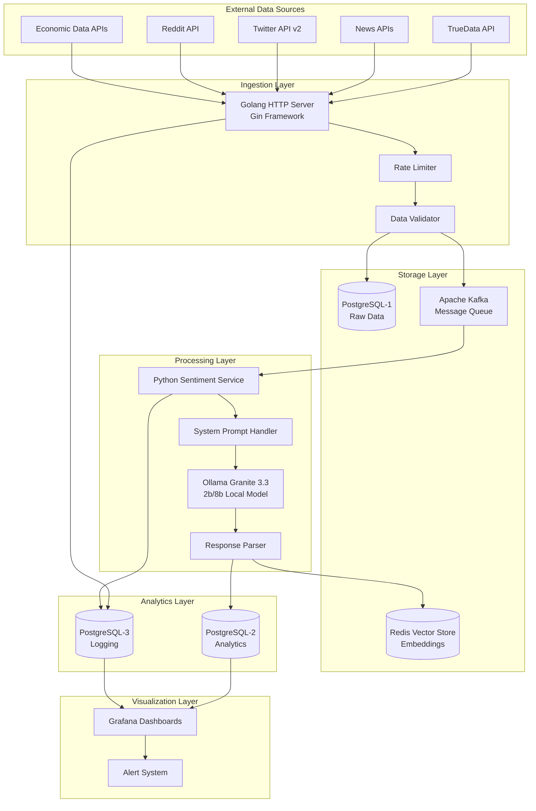

# Real-Time Sentiment Analysis System

A high-performance, scalable microservices architecture for real-time sentiment analysis of financial data streams using local AI models.

## 🎯 Project Overview

The Real-time Sentiment Analysis (RTSA) system processes financial data streams through a multi-stage pipeline, providing real-time sentiment insights from various data sources including market data, news, social media, and economic indicators. The system emphasizes performance, scalability, and real-time processing while maintaining data integrity and comprehensive monitoring capabilities.

### Key Features

- **Real-time Processing**: Sub-10 second sentiment analysis pipeline
- **Local AI Models**: Ollama Granite 3.3 (2b/8b) for privacy and performance
- **Scalable Architecture**: Microservices with horizontal scaling capabilities
- **Multi-source Ingestion**: Support for TrueData, news APIs, Twitter, Reddit, and economic data
- **Vector Similarity**: Redis-based content deduplication and similarity search
- **Comprehensive Monitoring**: Grafana dashboards with real-time metrics and alerting

## 🏗️ Architecture

### High-Level Architecture



### Service Communication

The system uses asynchronous communication through Kafka topics:

1. **Ingestion → Processing**: `sentiment_analysis_topic`
2. **Processing → Aggregation**: `aggregation_topic`  
3. **Alerts**: `alert_topic`

## 📁 Project Structure

```
├── README.md
├── docker-compose.yml              # Infrastructure services
├── .kiro/
│   └── specs/
│       └── real-time-sentiment-analysis/
│           ├── requirements.md     # Project requirements
│           ├── design.md          # Architecture design
│           └── tasks.md           # Implementation tasks
├── services/
│   ├── ingestion/                 # Golang HTTP ingestion service
│   │   ├── go.mod
│   │   ├── go.sum
│   │   ├── config.yaml           # Service configuration
│   │   └── validate_connections.go
│   └── sentiment-analysis/        # Python sentiment analysis service
│       ├── requirements.txt
│       ├── .env                  # Environment variables
│       └── validate_connections.py
├── sql/                          # Database initialization scripts
│   ├── init-raw-db.sql          # Raw data database schema
│   ├── init-analytics-db.sql    # Analytics database schema
│   └── init-logging-db.sql      # Logging database schema
├── grafana/                     # Grafana configuration
│   └── provisioning/
│       └── datasources/
│           └── datasources.yml  # PostgreSQL datasources
└── scripts/                     # Utility scripts
    ├── setup-kafka-topics.sh    # Kafka topic creation
    └── start-databases.sh       # Database startup script
```

## 🚀 Quick Start

### Prerequisites

- **Docker & Docker Compose**: For infrastructure services
- **Go 1.22+**: For ingestion service development
- **Python 3.11+**: For sentiment analysis service
- **Ollama**: For local AI model inference

### 1. Clone and Setup

```bash
git clone <repository-url>
cd real-time-sentiment-analysis
```

### 2. Start Infrastructure Services

```bash
# Start all infrastructure services (PostgreSQL, Kafka, Redis, Grafana)
docker compose up -d

# Wait for services to be healthy
docker compose ps
```

### 3. Install Ollama and Models

```bash
# Install Ollama (if not already installed)
curl -fsSL https://ollama.ai/install.sh | sh

# Pull Granite 3.3 models
ollama pull granite3.3-dense:2b
ollama pull granite3.3-dense:8b
```

### 4. Setup Go Development Environment

```bash
cd services/ingestion

# Install dependencies
go mod tidy

# Validate connections
go run validate_connections.go
```

### 5. Setup Python Development Environment

```bash
cd services/sentiment-analysis

# Create virtual environment
python3 -m venv venv
source venv/bin/activate

# Install dependencies
pip install -r requirements.txt

# Validate connections
python validate_connections.py
```

### 6. Access Services

- **Grafana Dashboard**: http://localhost:3000 (admin/admin)
- **Redis Insight**: http://localhost:8002
- **Kafka**: localhost:9092
- **PostgreSQL Databases**:
  - Raw Data: localhost:5435
  - Analytics: localhost:5433
  - Logging: localhost:5434

## 🔧 Configuration

### Environment Variables

#### Ingestion Service (Go)
Configuration is managed through `services/ingestion/config.yaml`:

```yaml
server:
  port: 8080
  read_timeout: 30
  write_timeout: 30

database:
  host: localhost
  port: 5435
  name: rtsa_raw
  user: rtsa_user
  password: rtsa_password

kafka:
  brokers:
    - localhost:9092
  topics:
    sentiment_analysis: sentiment_analysis_topic

rate_limit:
  requests_per_second: 100
  burst_size: 200
```

#### Sentiment Analysis Service (Python)
Configuration is managed through `services/sentiment-analysis/.env`:

```env
# Database Configuration
ANALYTICS_DB_HOST=localhost
ANALYTICS_DB_PORT=5433
ANALYTICS_DB_NAME=rtsa_analytics
ANALYTICS_DB_USER=rtsa_user
ANALYTICS_DB_PASSWORD=rtsa_password

# Kafka Configuration
KAFKA_BROKERS=localhost:9092
KAFKA_CONSUMER_GROUP=sentiment-analysis-group
KAFKA_TOPIC_SENTIMENT_ANALYSIS=sentiment_analysis_topic

# Redis Configuration
REDIS_HOST=localhost
REDIS_PORT=6380

# Ollama Configuration
OLLAMA_HOST=http://localhost:11434
OLLAMA_MODEL=granite3.3-dense:2b
```

## 🗄️ Database Schema

### Raw Data Database (PostgreSQL-1)
Temporary storage for incoming data with automatic cleanup:

```sql
CREATE TABLE raw_data (
    id BIGSERIAL PRIMARY KEY,
    source VARCHAR(100) NOT NULL,
    source_id VARCHAR(255),
    content JSONB NOT NULL,
    timestamp TIMESTAMP WITH TIME ZONE NOT NULL,
    content_hash VARCHAR(64) NOT NULL UNIQUE,
    created_at TIMESTAMP WITH TIME ZONE DEFAULT NOW(),
    processed_at TIMESTAMP WITH TIME ZONE
);
```

### Analytics Database (PostgreSQL-2)
Processed sentiment results with aggregation views:

```sql
CREATE TABLE sentiment_results (
    id BIGSERIAL PRIMARY KEY,
    source_id VARCHAR(255) NOT NULL,
    content_hash VARCHAR(64) NOT NULL,
    timestamp TIMESTAMP WITH TIME ZONE NOT NULL,
    source_type VARCHAR(50) NOT NULL,
    content TEXT NOT NULL,
    sentiment_score DECIMAL(5,4) NOT NULL,
    sentiment_label VARCHAR(20) NOT NULL,
    confidence_score DECIMAL(5,4) NOT NULL,
    entities JSONB,
    metadata JSONB,
    created_at TIMESTAMP WITH TIME ZONE DEFAULT NOW()
);
```

### Logging Database (PostgreSQL-3)
System logs and error tracking:

```sql
CREATE TABLE system_logs (
    id BIGSERIAL PRIMARY KEY,
    level VARCHAR(10) NOT NULL,
    component VARCHAR(50) NOT NULL,
    message TEXT NOT NULL,
    metadata JSONB,
    timestamp TIMESTAMP WITH TIME ZONE DEFAULT NOW()
);
```

## 🧪 Testing

### Connection Validation

```bash
# Test Go service connections
cd services/ingestion
go run validate_connections.go

# Test Python service connections
cd services/sentiment-analysis
source venv/bin/activate
python validate_connections.py
```

### Health Checks

Once services are running, health check endpoints will be available:

- `GET /health` - Overall service health
- `GET /health/database` - Database connectivity
- `GET /health/kafka` - Kafka connectivity
- `GET /health/redis` - Redis connectivity
- `GET /health/model` - Ollama model availability

## 📊 Monitoring

### Grafana Dashboards

Access Grafana at http://localhost:3000 with credentials `admin/admin`. Pre-configured dashboards include:

- **System Overview**: Service health and performance metrics
- **Ingestion Metrics**: Request rates, response times, error rates
- **Sentiment Analysis**: Processing times, model performance, accuracy metrics
- **Data Flow**: Message queue metrics, processing pipeline status

### Key Metrics

- **Throughput**: Messages processed per second
- **Latency**: End-to-end processing time (target: <10s)
- **Accuracy**: Sentiment classification confidence scores
- **Error Rates**: Failed requests and processing errors
- **Resource Usage**: CPU, memory, and storage utilization

## 🔒 Security Considerations

- **Local AI Models**: No data sent to external AI services
- **Database Security**: Isolated databases with proper access controls
- **Rate Limiting**: Protection against API abuse
- **Input Validation**: Comprehensive data sanitization
- **Network Security**: Services communicate through internal networks

## 🚀 Deployment

### Development
```bash
# Start infrastructure
docker compose up -d

# Run services locally
cd services/ingestion && go run main.go
cd services/sentiment-analysis && python main.py
```

### Production
- Use Docker containers for all services
- Implement proper secrets management
- Configure monitoring and alerting
- Set up backup and disaster recovery
- Implement CI/CD pipelines

## 🤝 Contributing

1. Fork the repository
2. Create a feature branch
3. Make your changes
4. Add tests for new functionality
5. Submit a pull request

## 📄 License

This project is licensed under the MIT License - see the LICENSE file for details.

## 🆘 Support

For questions and support:
- Check the [design document](.kiro/specs/real-time-sentiment-analysis/design.md) for detailed architecture information
- Review [requirements](.kiro/specs/real-time-sentiment-analysis/requirements.md) for feature specifications
- Check [tasks](.kiro/specs/real-time-sentiment-analysis/tasks.md) for implementation progress

## 🔄 Development Status

Current implementation status can be tracked in the [tasks.md](.kiro/specs/real-time-sentiment-analysis/tasks.md) file:

- ✅ Infrastructure Setup (Databases, Kafka, Redis, Ollama)
- ✅ Development Environment Configuration
- 🚧 Core Service Implementation (In Progress)
- ⏳ API Integration
- ⏳ Testing and Optimization
- ⏳ Monitoring and Alerting Setup